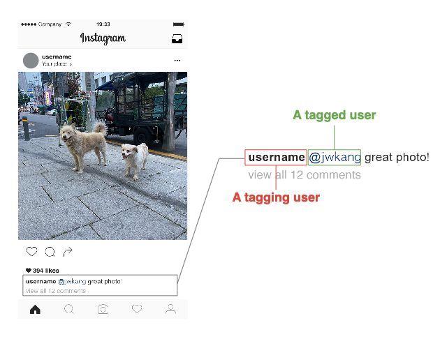

# Welcome to the Dataset for User Tagging Motiovation in a Comment Repo!



- We collected a large-scale comment data with user tagging data in Instagram, and created user tagging motivation dataset for comment-tagging. Our dataset includes information-, relationship-, and discussion-oriented motivation. We believe the user tagging motivation can be useful for opinion leaders, marketers, or content providers who seek to analyze user responses and identify a set of users with similar motivations/interests.
- For more details and analysis results on comment-tagging behavior in Instagram, please refer to [our publication](https://doi.org/10.1016/j.eswa.2022.117171). 


## Categories of User Tagging Motivation
we define the motivations of user tagging that can be classified into one of the following three motivations. Note that example posts and comments below are borrowed from our dataset.
- **Information-oriented motivation**: If a user talks about the information itself given from the post with a tagged user(s), the motivation is classified as information-oriented motivation. 
  - e.g., If a post displays an image of a dog wearing an avocado costume, and a user writes a comment like *“lol!! My favorite kind of avocado!!”* with user tagging, then the comment can be identified as information-oriented motivation.
- **Relationship-oriented motivation**: If a user has an interpersonal conversation with a tagged user(s), and the post just mediates or fosters their conversations or even is not mentioned, the motivation is classified as relationship-oriented motivation. 
  - e.g., if a post is about a landscape photography, and a user writes *“Dan and I were saying we have to go with you guys one day”* with user tagging, then the comment can be identified as relationship-oriented motivation.
- **Discussion-oriented motivation**: If a user and their tagged user(s) discuss the post, the motivation is classified as discussion-oriented motivation.
  - e.g., if a post shows a story about the right of minority religions, and a user writes *“except its a ploy to cast established religions in a negative light. Parody is not a religion”* with user tagging, then the comment can be classified as discussion-oriented motivation.

## Dataset Description
- The user tagging dataset includes 747 comments: information- (n=313), relationship- (n=369), and discussion-oriented motivation (n=65). 
- The dataset includes a comment text (with removing tagged username), the corresponding tagging motivation, and the associated the post text.

## Request for dataset
Thank you for your interest in our user tagging motivation dataset 😊 Please email us with the following information.
- Brief description of the analysis that the user would like to conduct using the requested data
- Name
- Affiliation

## Citation
```
@article{KANG2022117171,
title = {“Why tag me?”: Detecting motivations of comment tagging in Instagram},
journal = {Expert Systems with Applications},
volume = {202},
pages = {117171},
year = {2022},
issn = {0957-4174},
doi = {https://doi.org/10.1016/j.eswa.2022.117171},
url = {https://www.sciencedirect.com/science/article/pii/S0957417422005590},
author = {Jiwon Kang and Jeewoo Yoon and Eunil Park and Jinyoung Han},
}
```
